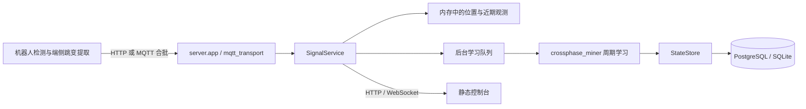

# 架构与边界

## 数据路径

`crossphase_miner` 不依赖 Web 框架或数据库。`server/service.py` 编排实时状态与学习，
`store.py` 负责两个数据库后端，`app.py` 和 `mqtt_transport.py` 提供传输接口。
离线 CLI 使用当前算法；历史 v2 只在隔离临时目录内执行。

## 数据与时间

位置与帧投票保存在内存中，过期后不再当成当前观测。数据库保存路口、模型、学习器、
精确红灯时长、模型里程碑、到访记录和持久化学习任务七类状态；原始 15 FPS 图像与每一帧不长期存储。
到访与原始跳变任务在同一个事务中接收，学习器在独立副本上计算，然后将模型、学习器、
精确红灯时长、里程碑与任务完成状态一起提交。失败任务保留并退避重试；重启扫描未完成任务。
同一路口的任务按服务端接收顺序处理，失败任务不会被后续任务越过；其他路口仍可学习。
当前仍要求单个后端处理一套数据库，持久化任务不意味着已支持多个学习 worker 并行运行。

机器人将完整到访报告先写入本地 SQLite outbox，稳定报告 ID 在重发时不变。
HTTP 返回 `stored: true`；MQTT 通过单独的应用确认 topic 返回相同信息。
确认表示到访与任务已落库，不表示模型学习已经完成。机器人收到匹配的报告 ID 与机器人 ID
确认后才删除本地记录。实时观测与行程保持原来的时效策略，不补传历史帧。

模型预测不替代视觉观测。

检测、跳变、投票窗口和行程以仿真时间计算；浏览器刷新和网络发送有真实时间调度。
实时数据新鲜度使用同一服务器快照的时间，避免高倍速下前端自行推时导致误判。
在线车队检测默认 15 FPS；历史离线仿真默认采样率仍为 10 Hz，用于保留原实验语义。

## 运行边界

当前服务按单进程设计，学习器和近期位置是进程内状态。不要直接增加 Uvicorn workers
或启动多个后端共享同一 MQTT 前缀；独立实验需要独立数据库和 topic 前缀。

整理工程结构不等于完成生产化：当前仍没有 API / 机器人鉴权和 TLS 终止。MQTT QoS 1 自身不是数据库提交确认，
本工程新增的应用确认建立在数据库事务成功返回之后。真实部署仍需补齐这些能力以及备份恢复演练、监控和负载验证。
现有 Compose 只将 PostgreSQL 与 Mosquitto 映射到本机回环地址。

模型预测、到访估算和仿真真值仅用于实验验证；六次跳变是样本门槛，达到门槛仍须满足置信度条件。
历史报告中的耗时与吞吐属于当时配置，当前性能应使用 `python -m scripts.bench_scale` 重测。
