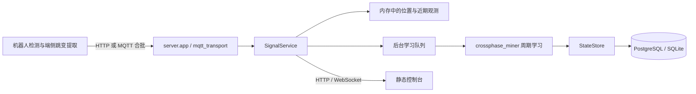

# 架构与边界

## 数据路径

`crossphase_miner` 不依赖 Web 框架或数据库。`server/service.py` 编排实时状态与学习，
`store.py` 负责两个数据库后端，`app.py` 和 `mqtt_transport.py` 提供传输接口。
离线 CLI 使用当前算法；历史 v2 只在隔离临时目录内执行。

## 数据与时间

位置与帧投票保存在内存中，过期后不再当成当前观测。数据库保存路口、模型、学习器、
精确红灯时长、模型里程碑和到访记录六类状态；原始 15 FPS 图像与每一帧不长期存储。
学习状态更新使用事务，到访按报告 ID 去重。模型预测不替代视觉观测。

检测、跳变、投票窗口和行程以仿真时间计算；浏览器刷新和网络发送有真实时间调度。
实时数据新鲜度使用同一服务器快照的时间，避免高倍速下前端自行推时导致误判。
在线车队检测默认 15 FPS；历史离线仿真默认采样率仍为 10 Hz，用于保留原实验语义。

## 运行边界

当前服务按单进程设计，学习器和近期位置是进程内状态。不要直接增加 Uvicorn workers
或启动多个后端共享同一 MQTT 前缀；独立实验需要独立数据库和 topic 前缀。

整理工程结构不等于完成生产化：当前没有 API / 机器人鉴权、TLS 终止、离线到访补传日志，
MQTT QoS 1 也不是数据库提交确认。真实部署仍需补齐这些能力以及备份恢复演练、监控和负载验证。
现有 Compose 只将 PostgreSQL 与 Mosquitto 映射到本机回环地址。

模型预测、到访估算和仿真真值仅用于实验验证；六次跳变是样本门槛，达到门槛仍须满足置信度条件。
历史报告中的耗时与吞吐属于当时配置，当前性能应使用 `python -m scripts.bench_scale` 重测。
